# AAE6102_Assignments

- [AAE6102\_Assignments](#aae6102_assignments)
  - [**Usage**](#usage)
  - [**Task 1 – Acquisition**](#task-1--acquisition)
    - [Urban](#urban)
    - [Opensky](#opensky)
  - [**Task 2 – Tracking**](#task-2--tracking)
    - [Urban](#urban-1)
    - [Opensky](#opensky-1)
    - [Discussion](#discussion)
  - [**Task 3 – Navigation Data Decoding**](#task-3--navigation-data-decoding)
    - [Urban](#urban-2)
      - [PRN 1](#prn-1)
      - [PRN 3](#prn-3)
      - [PRN 11](#prn-11)
      - [PRN 18](#prn-18)
    - [Opensky](#opensky-2)
      - [PRN 16](#prn-16)
      - [PRN 22](#prn-22)
      - [PRN 26](#prn-26)
      - [PRN 27](#prn-27)
      - [PRN 31](#prn-31)
  - [**Task 4 – Position and Velocity Estimation**](#task-4--position-and-velocity-estimation)
    - [Urban](#urban-3)
    - [Opensky](#opensky-3)
  - [**Task 5 – Kalman Filter-Based Positioning**](#task-5--kalman-filter-based-positioning)
    - [Urban](#urban-4)
    - [Opensky](#opensky-4)
    - [Discussion](#discussion-1)


## **Usage**

1. Change dataset path and identify which dataset at ```initSettings.m```.
```
settings.dataNo             = 0;  % 0 for Urban, 1 for Opensky
% This is a "default" name of the data file (signal record) to be used in
% the post-processing mode

if (settings.dataNo == 0)
    settings.fileName           = 'C:\Users\mint\Documents\dataset\GNSS\Urban.dat';
    settings.IF                 = 0;
    settings.samplingFreq       = 26e6;
else
    settings.fileName           = 'C:\Users\mint\Documents\dataset\GNSS\Opensky.bin';
    settings.IF                 = 4.58e6;
    settings.samplingFreq       = 58e6;
end

```

2. Run tasks one by one
```
Task_1_Acquistion
```
```
Task_2_Tracking
```
```
Task_3_DataDecoding
```
```
Task_4_PositionandVelocityEstimation
```
```
Task_5_KalmanFilterBasedPositioning

```

## **Task 1 – Acquisition**

Process the **IF data** using a **GNSS SDR** and generate the initial acquisition results.

### Urban
 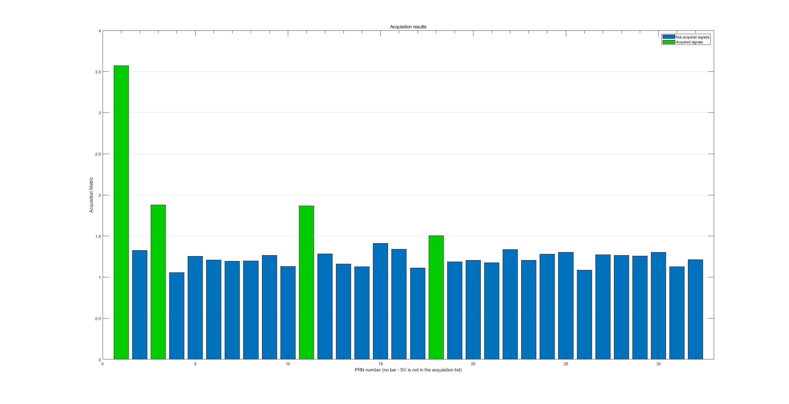
### Opensky
 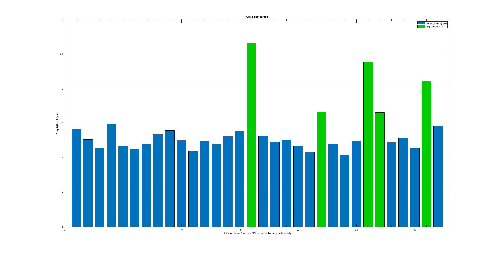

## **Task 2 – Tracking**

Adapt the **tracking loop (DLL)** to generate **correlation plots** and analyze the tracking performance. Discuss the impact of urban interference on the correlation peaks. *(Multiple correlators must be implemented for plotting the correlation function.)*

### Urban
 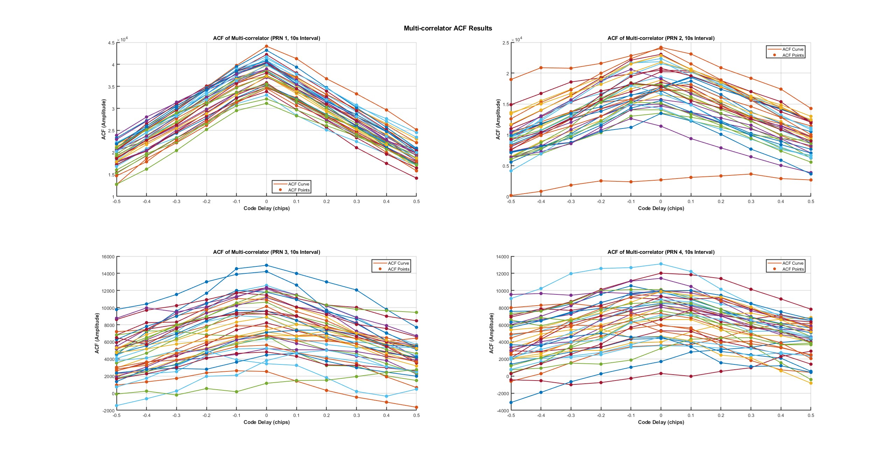
### Opensky
 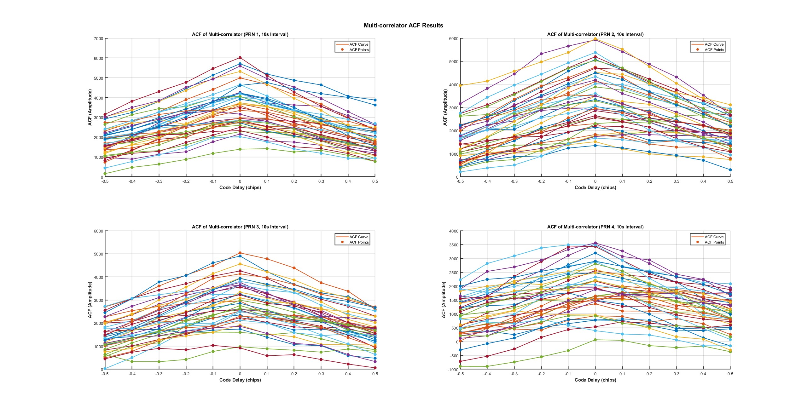

### Discussion
- Multipath:
> Multipath interference causes the correlation peak to broaden, shift, or develop secondary peaks. This distorts the true peak position, leading to errors in pseudorange measurements. The constructive and destructive interference of multipath signals can reduce the amplitude of the correlation peak, making it harder to detect. The correlation peak may become asymmetric, with a steeper leading edge and a trailing edge due to delayed multipath signals.

- NLOS:
> NLOS signals can create false correlation peaks that are stronger than the true peak, leading to incorrect pseudorange measurements. The correlation peak may shift away from its true position due to the additional path delay introduced by reflections. NLOS signals are typically weaker and noisier, reducing the overall quality of the correlation peak.

## **Task 3 – Navigation Data Decoding**

Decode the **navigation message** and extract key parameters, such as **ephemeris data**, for at least one satellite.

### Urban

#### PRN 1
| Field Name     | Field Value               |
|----------------|---------------------------|
| C_ic           | -7.45058059692383e-08     |
| omega_0        | -3.10603580061844         |
| C_is           | 1.60187482833862e-07      |
| i_0            | 0.976127704025531         |
| C_rc           | 287.46875                 |
| omega          | 0.711497598513721         |
| omegaDot       | -8.16962601200124e-09     |
| IODE_sf3       | 72                        |
| iDot           | -1.81078971237415e-10     |
| idValid        | 2 0 3                     |
| weekNumber     | 1032                      |
| accuracy       | 0                         |
| health         | 0                         |
| T_GD           | 5.58793544769287e-09      |
| IODC           | 12                        |
| t_oc           | 453600                    |
| a_f2           | 0                         |
| a_f1           | -9.43600753089413e-12     |
| a_f0           | -0.0000348975881934166    |
| IODE_sf2       | 72                        |
| C_rs           | -120.71875                |
| deltan         | 4.19088885305686e-09      |
| M_0            | 0.517930887728972         |
| C_uc           | -0.00000633485615253448   |
| e              | 0.00892308494076133       |
| C_us           | 0.0000053010880947113     |
| sqrtA          | 5153.65564346313          |
| t_oe           | 453600                    |
| TOW            | 449352                    |

#### PRN 3
| Field Name     | Field Value               |
|----------------|---------------------------|
| C_ic           | 1.11758708953857e-08      |
| omega_0        | -2.06417843827738         |
| C_is           | 5.21540641784668e-08      |
| i_0            | 0.96285874592588          |
| C_rc           | 160.3125                  |
| omega          | 0.594974558438532         |
| omegaDot       | -7.83246911092014e-09     |
| IODE_sf3       | 72                        |
| iDot           | 4.81091467962126e-10      |
| idValid        | 2 0 3                     |
| weekNumber     | 1032                      |
| accuracy       | 0                         |
| health         | 0                         |
| T_GD           | 1.86264514923096e-09      |
| IODC           | 4                         |
| t_oc           | 453600                    |
| a_f2           | 0                         |
| a_f1           | -1.13686837721616e-12     |
| a_f0           | 0.000186326447874308      |
| IODE_sf2       | 72                        |
| C_rs           | -62.09375                 |
| deltan         | 4.44768526394384e-09      |
| M_0            | -0.430397463873375        |
| C_uc           | -0.00000309012830257416   |
| e              | 0.00222623045556247       |
| C_us           | 0.0000115595757961273     |
| sqrtA          | 5153.77780151367          |
| t_oe           | 453600                    |
| TOW            | 449352                    |

#### PRN 11
| Field Name     | Field Value               |
|----------------|---------------------------|
| C_ic           | -3.16649675369263e-07     |
| omega_0        | 2.72577037566571           |
| C_is           | -1.32247805595398e-07     |
| i_0            | 0.909806735685279         |
| C_rc           | 324.40625                 |
| omega          | 1.89149296226273          |
| omegaDot       | -9.3043161335422e-09      |
| IODE_sf3       | 83                        |
| iDot           | 1.2857678431059e-11        |
| idValid        | 2 0 3                     |
| weekNumber     | 1032                      |
| accuracy       | 0                         |
| health         | 0                         |
| T_GD           | -1.2572854757309e-08       |
| IODC           | 229                       |
| t_oc           | 453600                    |
| a_f2           | 0                         |
| a_f1           | 8.5265128291212e-12        |
| a_f0           | -0.000590092502534389     |
| IODE_sf2       | 83                        |
| C_rs           | -67.125                   |
| deltan         | 5.89095966783022e-09       |
| M_0            | -0.198905418191913        |
| C_uc           | -0.0000036042183637619    |
| e              | 0.0166431387187913        |
| C_us           | 0.00000151246786117554    |
| sqrtA          | 5153.70659637451          |
| t_oe           | 453600                    |
| TOW            | 449352                    |

#### PRN 18
| Field Name     | Field Value               |
|----------------|---------------------------|
| C_ic           | -2.5331974029541e-07      |
| omega_0        | 3.12182125430595           |
| C_is           | 3.53902578353882e-08       |
| i_0            | 0.954642600078998          |
| C_rc           | 280.15625                 |
| omega          | 1.39301587576552           |
| omegaDot       | -8.61071581373341e-09      |
| IODE_sf3       | 56                        |
| iDot           | -1.61792453590826e-10      |
| idValid        | 2 0 3                     |
| weekNumber     | 1032                      |
| accuracy       | 0                         |
| health         | 0                         |
| T_GD           | -5.58793544769287e-09       |
| IODC           | 244                       |
| t_oc           | 453600                    |
| a_f2           | 0                         |
| a_f1           | 3.18323145620525e-12        |
| a_f0           | 5.98649494349957e-05         |
| IODE_sf2       | 56                        |
| C_rs           | -113.875                  |
| deltan         | 4.72019661513546e-09        |
| M_0            | 0.259840988631583          |
| C_uc           | -0.00000610947608947754    |
| e              | 0.0154198176460341          |
| C_us           | 0.00000511482357978821      |
| sqrtA          | 5153.69931793213           |
| t_oe           | 453600                    |
| TOW            | 449352                    |

### Opensky

#### PRN 16
| Field Name     | Field Value               |
|----------------|---------------------------|
| C_ic           | -1.00582838058472e-07     |
| omega_0        | -1.6742614288517          |
| C_is           | 1.3597309589386e-07       |
| i_0            | 0.971603403113095         |
| C_rc           | 237.6875                  |
| omega          | 0.679609496852005         |
| omegaDot       | -8.01283376668916e-09      |
| IODE_sf3       | 9                         |
| iDot           | -4.89306095848636e-10      |
| idValid        | 2 0 3                     |
| weekNumber     | 1155                      |
| accuracy       | 0                         |
| health         | 0                         |
| T_GD           | -1.02445483207703e-08      |
| IODC           | 234                       |
| t_oc           | 396000                    |
| a_f2           | 0                         |
| a_f1           | -6.3664629124105e-12        |
| a_f0           | -0.000406925100833178      |
| IODE_sf2       | 9                         |
| C_rs           | 23.34375                   |
| deltan         | 4.24660545959145e-09        |
| M_0            | 0.718116855169473           |
| C_uc           | 0.00000138953328132629      |
| e              | 0.0122962790774181          |
| C_us           | 0.00000768713653087616        |
| sqrtA          | 5153.77132225037             |
| t_oe           | 396000                      |
| TOW            | 390102                        |

#### PRN 22
| Field Name     | Field Value               |
|----------------|---------------------------|
| C_ic           | -1.00582838058472e-07     |
| omega_0        | 1.27273532182623           |
| C_is           | -9.31322574615479e-08      |
| i_0            | 0.936454582863647          |
| C_rc           | 266.34375                 |
| omega          | -0.887886685712927         |
| omegaDot       | -8.66857536667317e-09       |
| IODE_sf3       | 22                        |
| iDot           | -3.03584074066672e-11       |
| idValid        | 2 0 3                     |
| weekNumber     | 1155                      |
| accuracy       | 0                         |
| health         | 0                         |
| T_GD           | -1.76951289176941e-08       |
| IODC           | 218                       |
| t_oc           | 396000                    |
| a_f2           | 0                         |
| a_f1           | 9.2086338554509e-12          |
| a_f0           | -0.000489472411572933       |
| IODE_sf2       | 22                        |
| C_rs           | -99.8125                  |
| deltan         | 5.28307720422849e-09          |
| M_0            | -1.26096558850673           |
| C_uc           | -0.00000515580177307129     |
| e              | 0.00671353843063116         |
| C_us           | 0.00000516511499881744        |
| sqrtA          | 5153.71227264404             |
| t_oe           | 396000                      |
| TOW            | 390102                        |

#### PRN 26
| Field Name     | Field Value               |
|----------------|---------------------------|
| C_ic           | -2.04890966415405e-08      |
| omega_0        | -1.81293070066348          |
| C_is           | 8.94069671630859e-08        |
| i_0            | 0.939912327258295           |
| C_rc           | 234.1875                  |
| omega          | 0.295685419113132           |
| omegaDot       | -8.31141763247709e-09        |
| IODE_sf3       | 113                       |
| iDot           | -4.17517391275223e-10         |
| idValid        | 2 0 3                     |
| weekNumber     | 1155                      |
| accuracy       | 0                         |
| health         | 0                         |
| T_GD           | 6.98491930961609e-09          |
| IODC           | 15                        |
| t_oc           | 396000                    |
| a_f2           | 0                         |
| a_f1           | 3.97903932025656e-12          |
| a_f0           | 0.000144790392369032          |
| IODE_sf2       | 113                       |
| C_rs           | 21.25                     |
| deltan         | 5.05128183473523e-09            |
| M_0            | 1.73557093431869              |
| C_uc           | 0.00000115297734737396          |
| e              | 0.00625350861810148             |
| C_us           | 0.00000704079866409302            |
| sqrtA          | 5153.63645935059                 |
| t_oe           | 396000                          |
| TOW            | 390102                            |

#### PRN 27
| Field Name     | Field Value               |
|----------------|---------------------------|
| C_ic           | 1.08033418655396e-07        |
| omega_0        | -0.7174746604652            |
| C_is           | 1.15483999252319e-07         |
| i_0            | 0.974727542206028            |
| C_rc           | 230.34375                  |
| omega          | 0.630881664719351            |
| omegaDot       | -8.02426281418343e-09          |
| IODE_sf3       | 30                          |
| iDot           | -7.14315468392169e-13          |
| idValid        | 2 0 3                      |
| weekNumber     | 1155                        |
| accuracy       | 0                             |
| health         | 0                             |
| T_GD           | 1.86264514923096e-09            |
| IODC           | 4                             |
| t_oc           | 396000                        |
| a_f2           | 0                             |
| a_f1           | -5.00222085975111e-12            |
| a_f0           | -0.000206120777875185            |
| IODE_sf2       | 30                            |
| C_rs           | 70.4375                        |
| deltan         | 4.03016787266862e-09                |
| M_0            | -0.173022280718202                  |
| C_uc           | 0.00000373087823390961                |
| e              | 0.0095741068944335                    |
| C_us           | 0.00000824220478534698                    |
| sqrtA          | 5153.65202140808                         |
| t_oe           | 396000                                    |
| TOW            | 390102                                    |

#### PRN 31
| Field Name     | Field Value               |
|----------------|---------------------------|
| C_ic           | -1.13621354103088e-07      |
| omega_0        | -2.78727290293284         |
| C_is           | -5.02914190292358e-08      |
| i_0            | 0.95588255042505           |
| C_rc           | 240.15625                 |
| omega          | 0.311626182035606          |
| omegaDot       | -7.99497587997936e-09       |
| IODE_sf3       | 83                        |
| iDot           | 3.21441960776476e-11          |
| idValid        | 2 0 3                     |
| weekNumber     | 1155                      |
| accuracy       | 0                         |
| health         | 0                         |
| T_GD           | -1.30385160446167e-08        |
| IODC           | 228                       |
| t_oc           | 396000                    |
| a_f2           | 0                         |
| a_f1           | -1.93267624126747e-12         |
| a_f0           | -0.000144899822771549         |
| IODE_sf2       | 83                        |
| C_rs           | 30.71875                   |
| deltan         | 4.8073431022793e-09             |
| M_0            | 2.82452321963233              |
| C_uc           | 0.00000146031379699707            |
| e              | 0.0102715539978817                |
| C_us           | 0.00000722892582416534            |
| sqrtA          | 5153.62238883972                 |
| t_oe           | 396000                            |
| TOW            | 390102                            |

## **Task 4 – Position and Velocity Estimation**

Using **pseudorange measurements** from tracking, implement the **Weighted Least Squares (WLS)** algorithm to compute the **user's position and velocity**.

- Plot the user **position** and **velocity**.
- Compare the results with the **ground truth**.
- Discuss the impact of **multipath effects** on the WLS solution.

### Urban

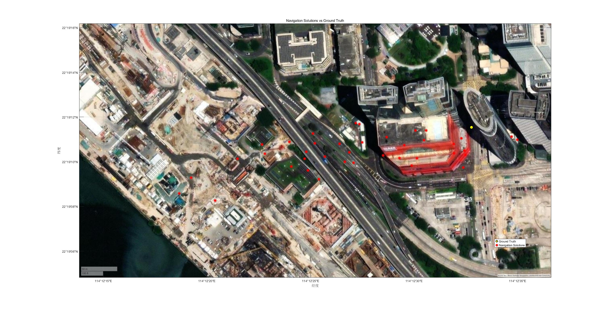

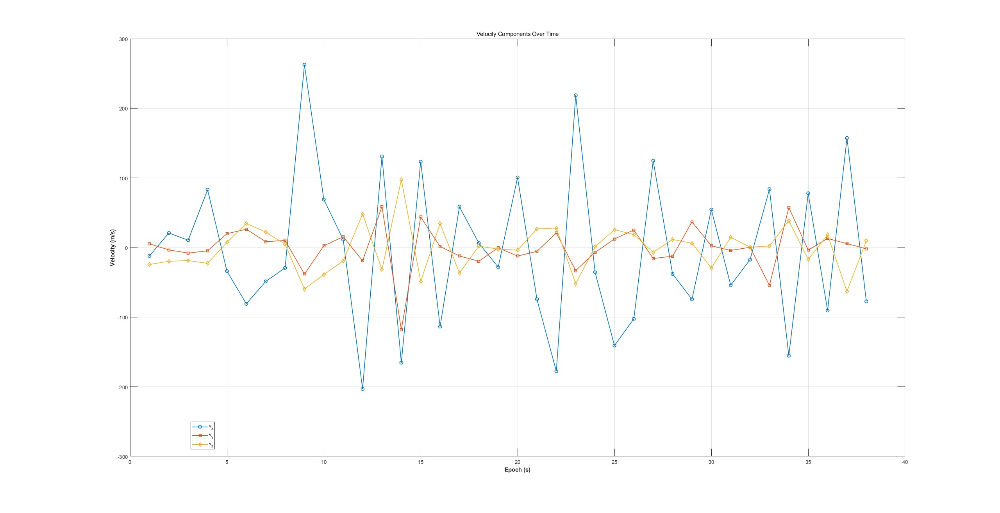

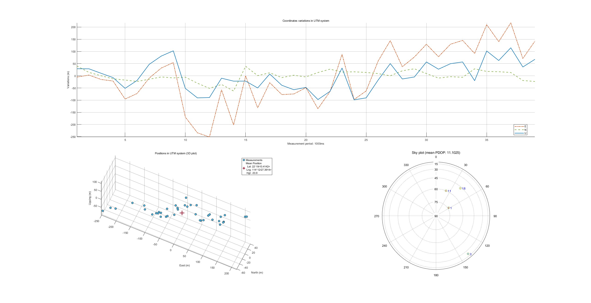

### Opensky

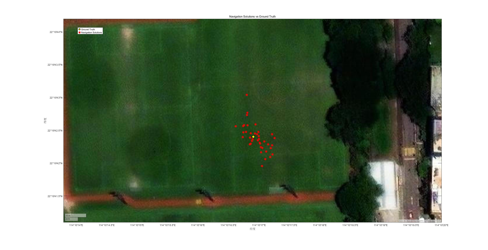

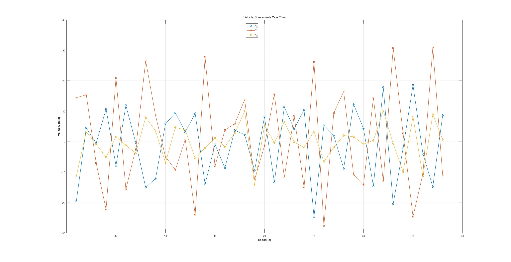

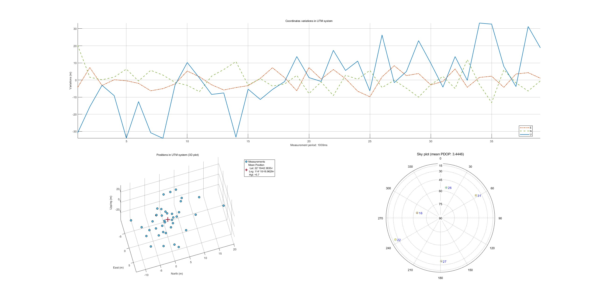

## **Task 5 – Kalman Filter-Based Positioning**

Develop an **Extended Kalman Filter (EKF)** using **pseudorange and Doppler measurements** to estimate **user position and velocity**.

### Urban

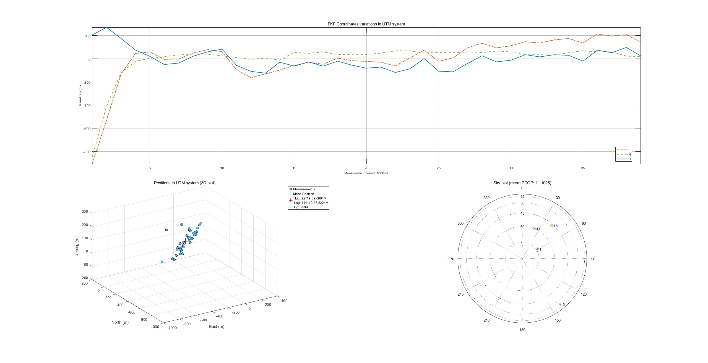

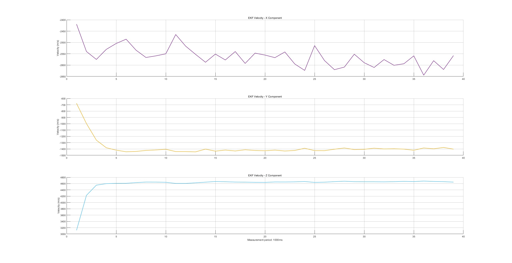


### Opensky

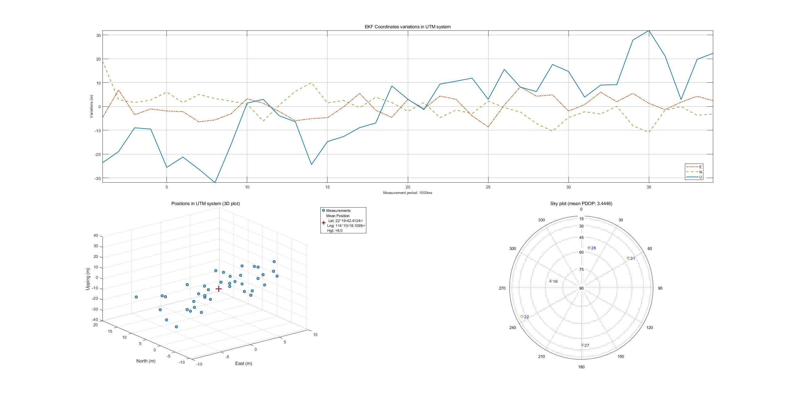

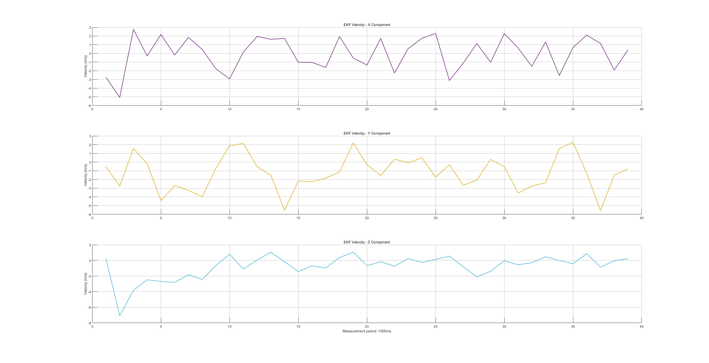

### Discussion


| Aspect	                | Impact of Multipath |
| --------	                | ------------------- |
| Pseudorange Measurements	| Introduces bias and increases noise in pseudorange measurements. |
| Residuals	                | Increases residuals, leading to larger errors in the WLS cost function. |
| Bias in Solution	        | Introduces systematic errors (bias) in the estimated position. |
| Weighting Matrix	        | Degrades the effectiveness of the weighting matrix, leading to over-reliance on corrupted measurements. |
| Position Accuracy	        | Causes horizontal and vertical position errors, ranging from meters to tens of meters. |
| Solution Stability	    | Reduces solution stability, causing jumps or drifts in the estimated position. |
